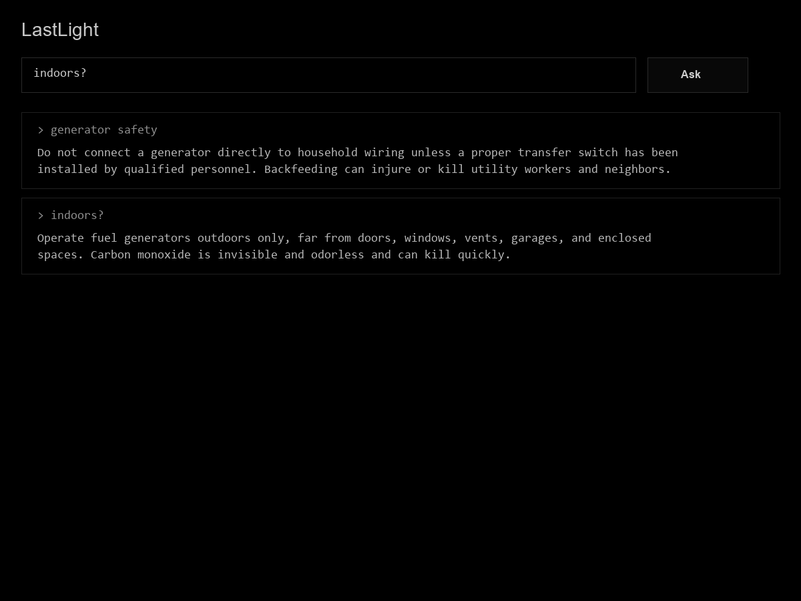

# LastLight

**Offline emergency knowledge retrieval for low-power, no-network conditions.**

LastLight is a tiny local RAG-style knowledge capsule. It searches Markdown knowledge packs, returns sourced passages, and refuses to answer when confidence is too low. It uses only the Python standard library: no cloud API, embeddings, vector database, telemetry, package install, browser, or background service.

## Clone

```bash
git clone https://github.com/edujbarrios/lastlight.git
cd lastlight
```

## Run

```bash
python src/main.py
python src/main.py "how do I purify water"

# Use --knowledge when adding an external knowledge pack beyond this repo's built-in knowledge.
python src/main.py --knowledge path/to/pack.zip "find north without a compass"
```

## Frontend

Start the optional local web UI. It uses a pure black, low-brightness theme and shows only the answer passage:

```bash
python src/main.py --serve
```

Open `http://127.0.0.1:8765`.

The web session keeps short-lived context for follow-up questions.



## Features

- Offline terminal search over `knowledge/en/`, `knowledge/es/`, or custom packs
- Sourced answers with confidence, language, tags, and source paths
- Lexical, BM25, and optional C-backed lexical retrieval
- Lightweight session memory for follow-up questions in interactive and web modes
- Directory and deterministic `.zip` knowledge packs
- Pack validation, export, metadata, and SHA-256 audit indexes
- Optional minimal dark local web UI
- Optional experimental n-gram synthesis and local model packs

## Commands

| Task | Command |
| --- | --- |
| Interactive mode | `python src/main.py` |
| Single query | `python src/main.py "stop bleeding"` |
| Use another pack | `python src/main.py --knowledge path/to/pack.zip "save battery"` |
| Filter language | `python src/main.py --language es "necesito ayuda"` |
| Evaluate retrieval | `python src/main.py --eval` |
| Custom eval JSON | `python src/main.py --eval --eval-output eval/results.json` |
| Choose retrieval | `python src/main.py --strategy bm25 "purify water"` |
| Build C core | `python tools/build_c_core.py` |
| Inspect pack | `python src/main.py --pack-info` |
| List knowledge | `python src/main.py --list-knowledge` |
| Validate pack | `python src/main.py --validate-pack` |
| Export pack | `python src/main.py --export-pack dist/lastlight-core.zip` |
| Build audit index | `python src/main.py --build-index data/lastlight.index.json` |
| Device self-check | `python src/main.py --self-check` |
| Local web UI | `python src/main.py --serve` |
| Run tests | `python -m unittest discover -s tests` |

## Knowledge

Add Markdown files under the matching language section, such as `knowledge/en/` or `knowledge/es/`:

```markdown
---
title: Water Purification
language: en
tags:
  - water
  - purification
priority: high
---

If water may be contaminated, boil it...
```

Knowledge packs can include `lastlight-pack.json` for reproducible metadata. See [docs/knowledge_packs.md](docs/knowledge_packs.md).

## Docs

- [Architecture](docs/architecture.md)
- [Roadmap](docs/roadmap.md)
- [Performance](docs/performance.md)
- [Platforms](docs/platforms.md)
- [Native C core](docs/native_core.md)
- [Local model packs](docs/local_models.md)

## License

Mozilla Public License 2.0.
